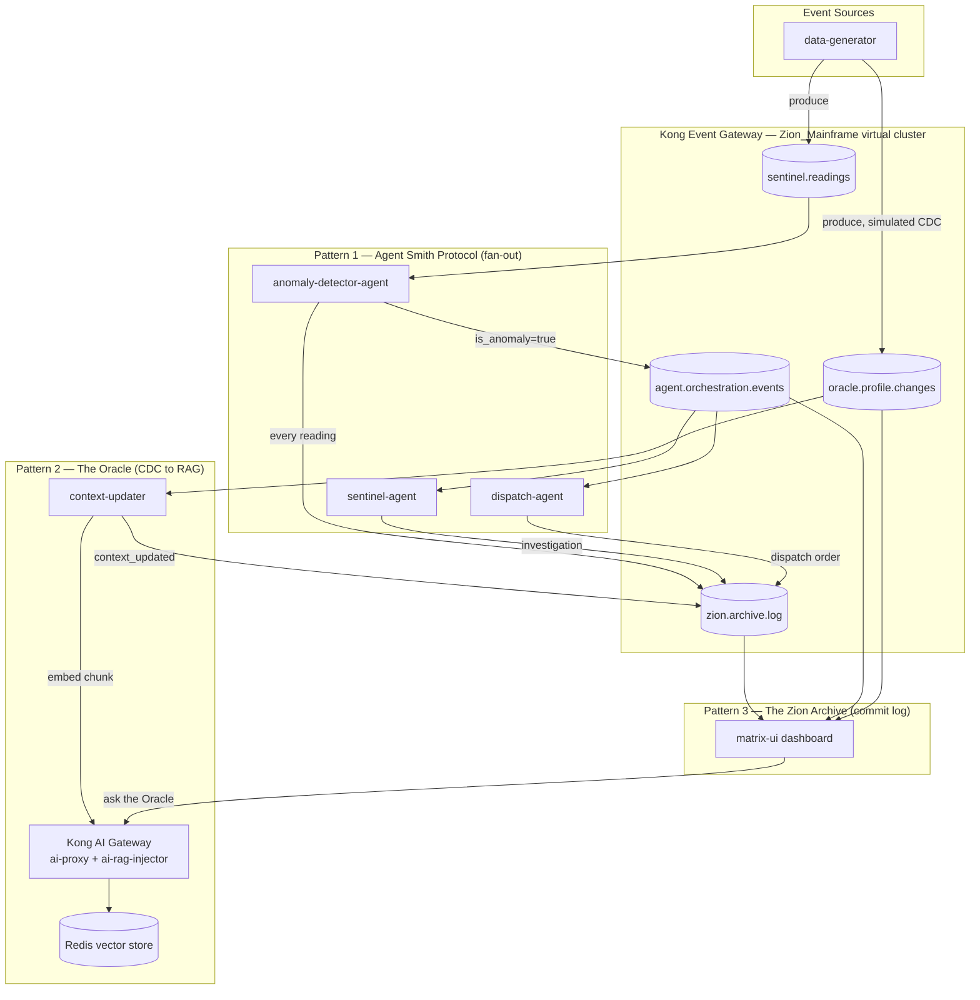

# Event-Driven AI Patterns Demo

A short, presentable demo of **three canonical event-driven-architecture (EDA) patterns for AI systems**, built on Kong Event Gateway (KEG) and Kong AI Gateway. Forked from the ["Matrix" SKO demo](../sko-fy27-se-enablement-keg) and re-scoped so the whole thing runs in one browser tab and presents in a few minutes.

The narrative keeps the Matrix theme, mapped 1:1 onto the three patterns:

| Pattern | Demo name | What it shows |
|---|---|---|
| 1. Agent orchestration via event fan-out | **The Agent Smith Protocol** | One anomaly event triggers *two* independent agents in parallel — like Smith replicating from one into many. |
| 2. Real-time context updates via CDC → RAG | **The Oracle** | Simulated database change events (CDC) are embedded into a vector store the instant they happen, so a chat endpoint always answers with fresh context. |
| 3. Memory & audit via a durable commit log | **The Zion Archive** | Every agent action, across the whole system, is appended to one Kafka topic — an immutable, replayable ledger that *is* the system's memory. |

## Architecture



**One Kafka backend, one virtual cluster.** Unlike the baseline SKO demo (three virtual clusters simulating three regions), this demo uses a single KEG virtual cluster (`Zion_Mainframe`, passthrough mode) so the topic graph above is the entire story — no region-hopping needed to follow it.

**Provisioning is declarative via `kongctl`, not Terraform — for both gateways.** The Event Gateway's Konnect resources (gateway, backend cluster, virtual cluster, listener, schema-registry binding) are defined in `event-gateway/kongctl/config.yaml` and pushed with `kongctl apply -f kongctl/config.yaml`, mirroring the pattern used in [`kong-event-gw-examples`](../kong-event-gw-examples). The KEG data-plane runs as a plain container via `event-gateway/docker-compose.yaml` (image `kong/kong-event-gateway:1.2.0`), authenticating to Konnect over mTLS with a certificate registered once via `kongctl apply -f kongctl/data_plane_certificate.yaml`.

The AI Gateway follows the same shape, adapted to Kong Gateway's resource model: `ai-gateway/kongctl/config.yaml` declares a Konnect `control_planes` resource named `ai-gateway` with a `_deck` block pointing at `ai-gateway/kongctl/kong.yaml` — kongctl's built-in decK integration, which runs `deck gateway apply` against that control plane for you. `kong.yaml` is an ordinary Kong declarative file (the `ai-gw` service, `/chat` route, and the `ai-proxy` / `ai-rag-injector` / `cors` plugins), but instead of being loaded directly into a DB-less Kong node, it's pushed to Konnect and replicated down to a self-hosted Kong Gateway **data-plane** container (`ai-gateway/docker-compose.yaml`, `KONG_ROLE=data_plane`, hybrid mode) that stays local so it can reach the Redis vector store on the same Docker network. Both gateways are provisioned the same way: generate an mTLS cert, register it with `kongctl`, start the local data-plane container, then `kongctl apply` the actual configuration.

**Five backend Node/TypeScript services**, all connecting through the KEG virtual cluster (`localhost:19092`) with `kafkajs`, using `volcano-sdk` (OpenAI `gpt-4o-mini`) for the three LLM-powered agents:

- `data-generator` — produces `sentinel.readings` (~every 3s, ~1-in-4 anomalous) and `oracle.profile.changes` (~every 5s, simulated CDC).
- `anomaly-detector-agent` — consumes `sentinel.readings`, judges anomalies with an LLM, publishes to `agent.orchestration.events` when anomalous, always publishes to `zion.archive.log`.
- `sentinel-agent` — consumer group `sentinel-response-group` on `agent.orchestration.events`; investigates and writes to `zion.archive.log`.
- `dispatch-agent` — consumer group `dispatch-response-group` on the *same* `agent.orchestration.events` topic; drafts a dispatch order and writes to `zion.archive.log`. Two different consumer groups on one topic is the fan-out.
- `context-updater` — consumes `oracle.profile.changes`, POSTs each change's `note` into Kong AI Gateway's `ai-rag-injector` (embeds via OpenAI `text-embedding-3-small`, stores in Redis), writes to `zion.archive.log`.

**`matrix-ui`** is the control plane and dashboard: it consumes all four topics into a WebSocket feed, exposes start/stop for each of the five services (no terminals needed live), and proxies a chat box to Kong AI Gateway's `/chat` route so you can literally ask the Oracle a question mid-demo.

## Prerequisites

- Docker + Docker Compose
- Node.js >= 18
- [`kongctl`](https://developer.konghq.com/kongctl/) (provisions both Kong Event Gateway and the Kong Gateway AI Gateway control plane declaratively against Konnect; bundles decK for the latter)
- `openssl` (generates the mTLS certificates for both data-plane containers)
- A Kong Konnect account + Personal Access Token
- An OpenAI API key (LLM agents + embeddings + chat)

## Setup

```bash
# 1. Environment
cp .env.example .env        # fill in OPENAI_API_KEY

# 2. Backend Kafka cluster (3-node KRaft) + Apicurio schema registry
cd kafka
docker compose up -d
docker compose --profile init up    # creates topics + registers schemas, then exits
cd ..

# 3. Provision Kong Event Gateway (Zion_Mainframe virtual cluster) via kongctl
cd event-gateway
mkdir -p kongctl/certs
openssl req -new -x509 -nodes -newkey rsa:2048 \
  -subj "/CN=event-gateway/C=US" \
  -keyout kongctl/certs/key.crt \
  -out    kongctl/certs/tls.crt

export KONGCTL_DEFAULT_KONNECT_PAT=<your-personal-access-token>
kongctl apply -f kongctl/data_plane_certificate.yaml

CLUSTER_ID=$(kongctl get event-gateway event-driven-ai-patterns-gateway \
  --output json --jq '.id' --jq-raw-output)

cp konnect.env.example konnect.env
# Edit konnect.env: set KONG_KONNECT_REGION, KONG_KONNECT_DOMAIN, and paste $CLUSTER_ID
printf 'KONG_KONNECT_CLIENT_CERT="%s"\n' "$(cat kongctl/certs/tls.crt)" >> konnect.env
printf 'KONG_KONNECT_CLIENT_KEY="%s"\n'  "$(cat kongctl/certs/key.crt)"  >> konnect.env

docker compose up -d          # starts the KEG data plane
kongctl apply -f kongctl/config.yaml   # pushes backend cluster, virtual cluster, schema policy
cd ..

# 4. Provision the AI Gateway control plane (ai-proxy + ai-rag-injector) via kongctl
cd ai-gateway
mkdir -p kongctl/certs
openssl req -new -x509 -nodes -newkey ec:<(openssl ecparam -name secp384r1) \
  -keyout kongctl/certs/tls.key \
  -out    kongctl/certs/tls.crt \
  -days 1095 -subj "/CN=kong_clustering"

kongctl apply -f kongctl/data_plane_certificate.yaml

cp konnect.env.example konnect.env

# Populate KONG_CLUSTER_* endpoint variables automatically from Konnect:
CP=$(kongctl get gateway control-plane ai-gateway \
  --output json --jq '.config.control_plane_endpoint' --jq-raw-output \
  | sed 's|https://||')
TP=$(kongctl get gateway control-plane ai-gateway \
  --output json --jq '.config.telemetry_endpoint' --jq-raw-output \
  | sed 's|https://||')
sed -i '' \
  -e "s|KONG_CLUSTER_CONTROL_PLANE=.*|KONG_CLUSTER_CONTROL_PLANE=${CP}:443|" \
  -e "s|KONG_CLUSTER_SERVER_NAME=.*|KONG_CLUSTER_SERVER_NAME=${CP}|" \
  -e "s|KONG_CLUSTER_TELEMETRY_ENDPOINT=.*|KONG_CLUSTER_TELEMETRY_ENDPOINT=${TP}:443|" \
  -e "s|KONG_CLUSTER_TELEMETRY_SERVER_NAME=.*|KONG_CLUSTER_TELEMETRY_SERVER_NAME=${TP}|" \
  konnect.env

# Fill in OPENAI_API_KEY too (used by the {vault://env/OPENAI_API_KEY}
# references in kongctl/kong.yaml).

docker compose up -d                    # starts the AI Gateway data plane + Redis
kongctl apply -f kongctl/config.yaml    # pushes the ai-proxy/ai-rag-injector config via deck
cd ..

# 5. Install dependencies for every service
for d in data-generator anomaly-detector-agent sentinel-agent dispatch-agent context-updater; do
  (cd "$d" && npm install)
done
(cd matrix-ui && npm install && cd server && npm install)

# 6. Launch the dashboard (this is your control plane for the rest of the demo)
cd matrix-ui
npm run dev     # starts the React UI (:3000) + Express/WS server (:3001)
```

Open **http://localhost:3000**. Use the header's **Start All** button to launch the five backend services — no more terminals needed for the actual presentation.

Steps 2–4 are one-time bootstrap (the `kongctl apply` calls only need re-running when the declarative config actually changes); for a repeat demo you only need `docker compose up -d` in each of the three compose directories (`kafka/`, `event-gateway/`, `ai-gateway/`) plus step 6.

## Demo script (~4 minutes)

**0:00 — Open the dashboard, click Start All.**
"This is one event backbone — a single Kafka virtual cluster behind Kong Event Gateway — driving three different AI patterns you'll see teams ask for independently. Watch all three panels; they're all fed by the same stream of events."

**0:30 — Panel 1: The Agent Smith Protocol (orchestration / fan-out).**
Within ~15-20 seconds an anomaly appears. Point at the paired responses landing next to it.
"One anomaly event went out on `agent.orchestration.events`. Two independent agents — Sentinel and Dispatch — are separate consumer groups on that *same* topic, so both received it and acted in parallel, with no coordination between them and no orchestrator polling anyone. That's fan-out: publish once, any number of agents react independently. This is how you wire up multi-agent systems without a central dispatcher becoming a bottleneck or a single point of failure."

**1:45 — Panel 2: The Oracle (CDC → RAG).**
Point at a fresh profile-change event scrolling in.
"This is a simulated change-data-capture stream — think a Debezium feed off a real database. The instant a record changes, `context-updater` embeds it and writes it into the vector store behind Kong AI Gateway. No batch re-indexing job, no nightly ETL — the assistant's knowledge is as fresh as the last committed change."
Type a question into the chat box referencing a name currently visible in the feed (e.g. "What's Trinity's current status?") and show the answer reflecting the latest change.
"That answer came from context that didn't exist sixty seconds ago."

**2:45 — Panel 3: The Zion Archive (memory & audit).**
Point at the scrolling ledger.
"Every action any agent took — the anomaly detector's evaluation, both fan-out responses, every context update — landed here, on one durable, ordered, immutable Kafka topic. This is the system's memory: nothing is UPDATE'd or DELETE'd, it's all APPEND. That gives you a complete audit trail for free, and because it's Kafka, you can replay it from offset zero to rebuild any downstream view — including the RAG index or an incident timeline — from scratch. That's a durable commit log doing double duty as both audit trail and long-term agent memory."

**3:30 — Tie it together.**
"Same backbone, same governance model in Kong Event Gateway — schema validation, ACLs, one control plane — three different AI patterns: orchestration, real-time context, and memory/audit. That's the pitch for event-driven architecture as the substrate for agentic AI: it's not three separate integrations, it's one event mesh that all of them share."

**3:50 — Click Stop All.** Done.

## Repository layout

```
event-driven-ai-patterns-demo/
├── .kafkactl.yml                # kafkactl contexts (backend + Zion_Mainframe VC)
├── .env.example
├── kafka/                        # Everything needed to run the backend Kafka cluster
│   ├── docker-compose.yaml       # 3-node KRaft cluster + Apicurio + topic/schema bootstrap
│   └── config/
│       ├── topics.txt
│       └── schemas/              # JSON Schema per topic
├── data-generator/
├── anomaly-detector-agent/
├── sentinel-agent/
├── dispatch-agent/
├── context-updater/
├── event-gateway/                # KEG data-plane docker-compose + kongctl declarative config
│   ├── docker-compose.yaml       # KEG data-plane container (kong/kong-event-gateway:1.2.0)
│   ├── konnect.env.example
│   └── kongctl/
│       ├── data_plane_certificate.yaml
│       ├── config.yaml           # backend cluster, virtual cluster, schema-validation policy
│       └── certs/                # mTLS identity (gitignored)
├── ai-gateway/                   # AI Gateway data-plane docker-compose + kongctl/decK config
│   ├── docker-compose.yaml       # Kong Gateway data-plane container (hybrid mode) + Redis
│   ├── konnect.env.example
│   └── kongctl/
│       ├── data_plane_certificate.yaml
│       ├── config.yaml           # control_planes + _deck pointer to kong.yaml
│       ├── kong.yaml             # decK state file: ai-gw service, /chat route, ai-proxy/ai-rag-injector/cors plugins
│       └── certs/                # mTLS identity (gitignored)
└── matrix-ui/                    # Dashboard + control plane (React + Express/WS)
```

## Topics & message shapes

| Topic | Producer(s) | Consumer(s) |
|---|---|---|
| `sentinel.readings` | data-generator | anomaly-detector-agent |
| `agent.orchestration.events` | anomaly-detector-agent | sentinel-agent, dispatch-agent |
| `oracle.profile.changes` | data-generator | context-updater |
| `zion.archive.log` | anomaly-detector-agent, sentinel-agent, dispatch-agent, context-updater | matrix-ui |

Full JSON Schemas live in `kafka/config/schemas/`.

## Notes / known limitations

- This sandbox build could not reach the npm registry, run Docker, run `kongctl`, or reach Konnect, so `npm install`, `tsc --noEmit`, `docker compose config`, `kongctl apply`, and the decK push should all be run once more in a networked environment before a live customer demo — treat this repo as code-complete but not yet execution-verified end-to-end.
- `ai-gateway/kongctl/kong.yaml` uses Kong's built-in `{vault://env/OPENAI_API_KEY}` env-vault syntax (Kong Gateway 3.x, no license required) — this is resolved locally by the data-plane container's own process environment at request time, regardless of the fact that the plugin config arrived via decK/Konnect rather than a local file. Confirm this resolves correctly against your Kong Gateway version before presenting.
- Neither `event-gateway/kongctl/certs/` nor `ai-gateway/kongctl/certs/` are populated with real key material — generate each mTLS cert/key pair yourself with the `openssl` commands in the Setup section above (only the public cert ever leaves your machine, via `kongctl apply`). Note the AI Gateway's cert uses an EC key (`ec:secp384r1`) per Kong Gateway's own hybrid-mode convention, while the Event Gateway's uses RSA — both are correct for their respective product.
- The `KONG_CLUSTER_CONTROL_PLANE` / `KONG_CLUSTER_TELEMETRY_ENDPOINT` hostnames in `ai-gateway/konnect.env` are unique to your Konnect org/region and can only be obtained from the Konnect UI after the `ai-gateway` control plane exists (Gateway Manager → New Data Plane Node → Docker tab) — they can't be derived ahead of time.
- The exact `kongctl apply`/`kongctl get` flag syntax (e.g. `--jq`) mirrors what's used in [`kong-event-gw-examples`](../kong-event-gw-examples) — reconfirm against your installed `kongctl` version's `--help` output if it errors.
