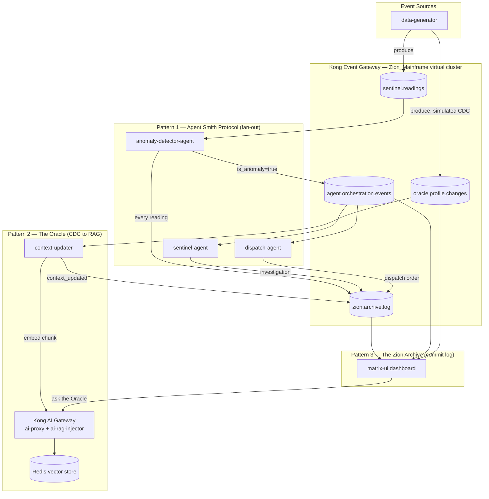

# Event-Driven AI Patterns Demo

A short, presentable demo of **three canonical event-driven-architecture (EDA) patterns for AI systems**, built on Kong Event Gateway (KEG) and Kong AI Gateway. Forked from the ["Matrix" SKO demo](../sko-fy27-se-enablement-keg) and re-scoped so the whole thing runs in one browser tab and presents in a few minutes.

The narrative keeps the Matrix theme, mapped 1:1 onto the three patterns:

| Pattern | Demo name | What it shows |
|---|---|---|
| 1. Agent orchestration via event fan-out | **The Agent Smith Protocol** | One anomaly event triggers *two* independent agents in parallel — like Smith replicating from one into many. |
| 2. Real-time context updates via CDC → RAG | **The Oracle** | Simulated database change events (CDC) are embedded into a vector store the instant they happen, so a chat endpoint always answers with fresh context. |
| 3. Memory & audit via a durable commit log | **The Zion Archive** | Every agent action, across the whole system, is appended to one Kafka topic — an immutable, replayable ledger that *is* the system's memory. |

## Architecture



**One Kafka backend, one virtual cluster.** Unlike the baseline SKO demo (three virtual clusters simulating three regions), this demo uses a single KEG virtual cluster (`Zion_Mainframe`, passthrough mode) so the topic graph above is the entire story — no region-hopping needed to follow it.

**Five backend Node/TypeScript services**, all connecting through the KEG virtual cluster (`localhost:19092`) with `kafkajs`, using `volcano-sdk` (OpenAI `gpt-4o-mini`) for the three LLM-powered agents:

- `data-generator` — produces `sentinel.readings` (~every 3s, ~1-in-4 anomalous) and `oracle.profile.changes` (~every 5s, simulated CDC).
- `anomaly-detector-agent` — consumes `sentinel.readings`, judges anomalies with an LLM, publishes to `agent.orchestration.events` when anomalous, always publishes to `zion.archive.log`.
- `sentinel-agent` — consumer group `sentinel-response-group` on `agent.orchestration.events`; investigates and writes to `zion.archive.log`.
- `dispatch-agent` — consumer group `dispatch-response-group` on the *same* `agent.orchestration.events` topic; drafts a dispatch order and writes to `zion.archive.log`. Two different consumer groups on one topic is the fan-out.
- `context-updater` — consumes `oracle.profile.changes`, POSTs each change's `note` into Kong AI Gateway's `ai-rag-injector` (embeds via OpenAI `text-embedding-3-small`, stores in Redis), writes to `zion.archive.log`.

**`matrix-ui`** is the control plane and dashboard: it consumes all four topics into a WebSocket feed, exposes start/stop for each of the five services (no terminals needed live), and proxies a chat box to Kong AI Gateway's `/chat` route so you can literally ask the Oracle a question mid-demo.

## Prerequisites

- Docker + Docker Compose
- Node.js >= 18
- Terraform >= 1.5
- A Kong Konnect account + Personal Access Token (for KEG provisioning)
- An OpenAI API key (LLM agents + embeddings + chat)

## Setup

```bash
# 1. Environment
cp .env.example .env        # fill in OPENAI_API_KEY, KONNECT_TOKEN
cd event-gateway && cp terraform.tfvars.example terraform.tfvars  # fill in konnect_token
cd ..

# 2. Backend Kafka cluster (3-node KRaft)
docker network create keg-network   # first time only
docker compose up -d

# 3. Provision Kong Event Gateway (Zion_Mainframe virtual cluster) via Konnect
cd event-gateway
terraform init
terraform apply
cd ..

# 4. Kong AI Gateway (ai-proxy + ai-rag-injector + Redis vector store)
cd ai-gateway
OPENAI_API_KEY=$OPENAI_API_KEY docker compose up -d
cd ..

# 5. Install dependencies for every service
for d in data-generator anomaly-detector-agent sentinel-agent dispatch-agent context-updater; do
  (cd "$d" && npm install)
done
(cd matrix-ui && npm install && cd server && npm install)

# 6. Launch the dashboard (this is your control plane for the rest of the demo)
cd matrix-ui
npm run dev     # starts the React UI (:3000) + Express/WS server (:3001)
```

Open **http://localhost:3000**. Use the header's **Start All** button to launch the five backend services — no more terminals needed for the actual presentation.

## Demo script (~4 minutes)

**0:00 — Open the dashboard, click Start All.**
"This is one event backbone — a single Kafka virtual cluster behind Kong Event Gateway — driving three different AI patterns you'll see teams ask for independently. Watch all three panels; they're all fed by the same stream of events."

**0:30 — Panel 1: The Agent Smith Protocol (orchestration / fan-out).**
Within ~15-20 seconds an anomaly appears. Point at the paired responses landing next to it.
"One anomaly event went out on `agent.orchestration.events`. Two independent agents — Sentinel and Dispatch — are separate consumer groups on that *same* topic, so both received it and acted in parallel, with no coordination between them and no orchestrator polling anyone. That's fan-out: publish once, any number of agents react independently. This is how you wire up multi-agent systems without a central dispatcher becoming a bottleneck or a single point of failure."

**1:45 — Panel 2: The Oracle (CDC → RAG).**
Point at a fresh profile-change event scrolling in.
"This is a simulated change-data-capture stream — think a Debezium feed off a real database. The instant a record changes, `context-updater` embeds it and writes it into the vector store behind Kong AI Gateway. No batch re-indexing job, no nightly ETL — the assistant's knowledge is as fresh as the last committed change."
Type a question into the chat box referencing a name currently visible in the feed (e.g. "What's Trinity's current status?") and show the answer reflecting the latest change.
"That answer came from context that didn't exist sixty seconds ago."

**2:45 — Panel 3: The Zion Archive (memory & audit).**
Point at the scrolling ledger.
"Every action any agent took — the anomaly detector's evaluation, both fan-out responses, every context update — landed here, on one durable, ordered, immutable Kafka topic. This is the system's memory: nothing is UPDATE'd or DELETE'd, it's all APPEND. That gives you a complete audit trail for free, and because it's Kafka, you can replay it from offset zero to rebuild any downstream view — including the RAG index or an incident timeline — from scratch. That's a durable commit log doing double duty as both audit trail and long-term agent memory."

**3:30 — Tie it together.**
"Same backbone, same governance model in Kong Event Gateway — schema validation, ACLs, one control plane — three different AI patterns: orchestration, real-time context, and memory/audit. That's the pitch for event-driven architecture as the substrate for agentic AI: it's not three separate integrations, it's one event mesh that all of them share."

**3:50 — Click Stop All.** Done.

## Repository layout

```
event-driven-ai-patterns-demo/
├── docker-compose.yaml          # 3-node Kafka KRaft backend cluster
├── .kafkactl.yml                # kafkactl contexts (backend + Zion_Mainframe VC)
├── .env.example
├── config/
│   ├── topics.txt
│   └── schemas/                 # JSON Schema per topic
├── data-generator/
├── anomaly-detector-agent/
├── sentinel-agent/
├── dispatch-agent/
├── context-updater/
├── event-gateway/                # Terraform: KEG provisioning via Konnect
└── ai-gateway/                   # Kong Gateway + Redis (ai-proxy, ai-rag-injector)
└── matrix-ui/                    # Dashboard + control plane (React + Express/WS)
```

## Topics & message shapes

| Topic | Producer(s) | Consumer(s) |
|---|---|---|
| `sentinel.readings` | data-generator | anomaly-detector-agent |
| `agent.orchestration.events` | anomaly-detector-agent | sentinel-agent, dispatch-agent |
| `oracle.profile.changes` | data-generator | context-updater |
| `zion.archive.log` | anomaly-detector-agent, sentinel-agent, dispatch-agent, context-updater | matrix-ui |

Full JSON Schemas live in `config/schemas/`.

## Notes / known limitations

- This sandbox build could not reach the npm registry, run Docker, or run Terraform, so `npm install`, `tsc --noEmit`, `docker compose config`, and `terraform validate` should be run once more in a networked environment before a live customer demo — treat this repo as code-complete but not yet execution-verified end-to-end.
- The `ai-gateway/kong-config/kong.yaml` uses Kong's built-in `{vault://env/OPENAI_API_KEY}` env-vault syntax (Kong Gateway 3.x, no license required) — confirm this resolves correctly against your Kong Gateway version before presenting.
- `event-gateway/certs/` is intentionally not populated — `keg_data_plane.tf` generates TLS material on `terraform apply`.
